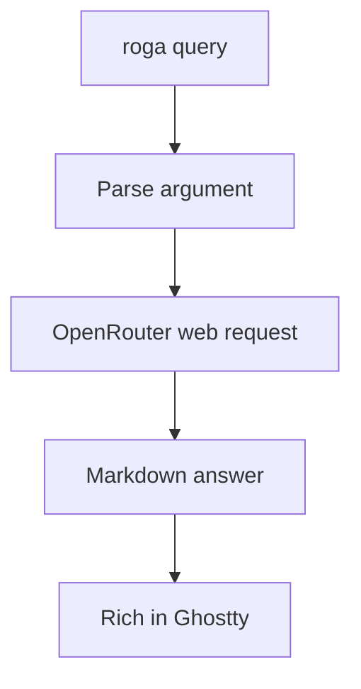

# Roga — Build Plan

> **Companion to:** `OUTLINE.md` (read that first for the what/why)
> **This file is:** the how — every task, in order, addressable down to the block.

**How to use this file:** work top to bottom, one block at a time. Check boxes as you go. Do not cross a Phase Checkpoint until it passes. Blocks use `Phase.Task.Block` addresses such as `2.1.3`; use those addresses when discussing, delegating, or resuming work.

**Learning rule:** attempt the pseudocode yourself before requesting implementation. An assistant may explain a concept, give a hint, review a diff, or help diagnose an error. Full implementation is the last resort, not the opening ceremony.

---

## Agent Delegation Protocol

When handed a block reference such as `do 2.1.1`:

1. Read the relevant Phase and Task headers, then execute only the named block(s).
2. Respect the task's **Don't touch** list. No opportunistic refactoring.
3. Ask first before adding/upgrading a dependency, changing a skeleton signature, modifying another task's files, or changing configuration structure.
4. Never commit secrets, skip/delete a failing test, or replace understandable code with a framework.
5. Report completion with evidence: the command run and its actual output.
6. If blocked, report the block address and reason, then stop. Do not quietly build a different project.
7. In learning mode, prefer one useful hint at a time. Do not provide the complete function body unless Matt explicitly asks after attempting it.

---

## Project Map

```text
roga/
├── .env.example             # names the required key and optional model
├── .gitignore               # protects secrets and ignores generated files
├── OUTLINE.md               # project purpose and locked scope
├── PLAN.md                  # executable build plan
├── README.md                # install, use, examples, troubleshooting
├── pyproject.toml           # dependencies and `roga` console entry point
├── src/
│   └── roga_cli/
│       ├── __init__.py      # package marker and version
│       ├── main.py          # CLI, configuration, rendering, error messages
│       ├── prompts.py       # answer-format system prompt
│       └── search.py        # one OpenRouter web-grounded request
└── tests/
    ├── test_main.py         # CLI and rendering behaviour
    └── test_search.py       # request construction and response handling
```



No additional application modules belong in V1 unless the plan is revised first.

---

## Phase 0: Scaffold and Walking Skeleton

**Phase goal:** Create an installable `roga` command that accepts a query and displays a fixed Markdown answer attractively in Ghostty.
**Time estimate:** 2–3 hours
**Files created / modified:** project scaffold, `pyproject.toml`, `.gitignore`, `.env.example`, `src/roga_cli/__init__.py`, `src/roga_cli/main.py`
**Phase constraint:** No OpenRouter client, API key access, network calls, search module, or tests yet.

### Task 0.1: Create the Project

**File:** project root, `pyproject.toml`, `.gitignore`, `.env.example`, `src/roga_cli/__init__.py`

**Skeleton:**

```toml
[project.scripts]
roga = "roga_cli.main:main"
```

**What it does:**

1. Run `pyinit roga-cli` so the distribution name is `roga-cli` and the import package is `roga_cli`.
2. Confirm Python 3.12 or newer and retain the generated src layout.
3. Add only the runtime dependencies needed now: `openai`, `rich`, and `python-dotenv`.
4. Add `pytest` as the sole development dependency.
5. Register the `roga` console command.
6. Ignore `.env`, virtual environments, caches, coverage output, and build artefacts.
7. Add `OPENROUTER_API_KEY=` and a commented optional `ROGA_MODEL=` example to `.env.example`.

**Imports needed:** None.

**Rules:** Use `uv add` and `uv add --dev`; never call `pip` directly. Do not add Typer, HTTPX, Pydantic, a configuration library, or Firecrawl.

**Don't touch:** `OUTLINE.md`, `PLAN.md`; do not create `search.py` or `prompts.py` yet.

**Blocks:**

- [ ] **0.1.1** — Run `pyinit roga-cli` and inspect the generated src layout before changing it.
- [x] **0.1.2** — Add the approved dependencies and the `roga` console entry point.
- [ ] **0.1.3** — Finish `.gitignore` and credential-free `.env.example`.
- [x] **0.1.4** — Verify: run `uv sync && uv run python -c "import openai, rich, dotenv"` → exits `0` with no traceback.

### Task 0.2: Build the Fake End-to-End Command

**File:** `src/roga_cli/main.py`

**Skeleton:**

```python
def parse_query() -> str:
    """Parse and return the required command-line query.

    Returns:
        The non-empty query supplied to the `roga` command.

    Raises:
        SystemExit: If the query is absent or invalid.
    """


def render_answer(answer: str) -> None:
    """Render a Markdown answer to the interactive terminal.

    Args:
        answer: Non-empty Markdown text to display.

    Raises:
        ValueError: If the answer is empty or whitespace-only.
    """


def main() -> None:
    """Run one Roga query and render its answer.

    Raises:
        SystemExit: If command input is invalid.
    """
```

**What it does:**

1. Create an `ArgumentParser` describing Roga as a quick terminal search tool.
2. Add one required positional argument named `query`; the shell quotes preserve it as one value.
3. Have `main` call `parse_query` and pass a fixed Markdown sample to `render_answer`.
4. Use Rich's `Console` and `Markdown` classes to display the sample, including a heading and fenced Python block.
5. Keep orchestration boring: parse, obtain answer, render. Boring control flow is excellent control flow.

**Imports needed:** `argparse.ArgumentParser`, `rich.console.Console`, `rich.markdown.Markdown`.

**Rules:** The fake answer is temporary but should demonstrate final formatting. Do not load `.env` or catch exceptions yet.

**Don't touch:** Dependency declarations after Task 0.1; do not create API-related files.

**Blocks:**

- [x] **0.2.1** — Implement `parse_query` with one required positional query.
- [ ] **0.2.2** — Implement `render_answer` and the fixed Markdown sample in `main`.
- [ ] **0.2.3** — Verify: run `uv run roga "python: join lists"` → Ghostty shows a readable heading, prose, and highlighted Python block.
- [x] **0.2.4** — Verify: run `uv run roga` → argparse prints usage to stderr and exits `2` without a traceback.

### Phase 0 Checkpoint

- [ ] `uv run roga "test"` traverses the entire fake path and renders cleanly.
- [x] `uv run roga --help` accurately describes the command and query.
- [x] Commit the walking skeleton before adding any network behaviour.

---

## Phase 1: Pure Request Logic and Tests

**Phase goal:** Define what Roga asks OpenRouter to do and prove the request shape without a network call.
**Time estimate:** 3–4 hours
**Files created / modified:** `src/roga_cli/prompts.py`, `src/roga_cli/search.py`, `tests/test_search.py`
**Phase constraint:** Do not instantiate the OpenAI client, read environment variables, or call the network.

### Task 1.1: Write the Answer Contract

**File:** `src/roga_cli/prompts.py`, `tests/test_search.py`

**Skeleton:**

```python
SYSTEM_PROMPT: str


def build_messages(query: str) -> list[dict[str, str]]:
    """Build the ordered messages for one Roga search.

    Args:
        query: The user's non-empty terminal-oriented question.

    Returns:
        A system message followed by the unchanged user query.

    Raises:
        ValueError: If the query is empty or whitespace-only.
    """
```

**What it does:**

1. Write a short system prompt that defines Roga as a quick terminal reference, not a deep-research assistant.
2. Require a direct two- or three-sentence opening.
3. Require a few common examples in fenced, language-labelled code blocks.
4. Permit grouping only when multiple methods genuinely exist.
5. Request one short recommendation or caution when useful.
6. Require concise Markdown source links and forbid long essays, meta-commentary, fake quotations, and Google's `Use code with caution` clutter.
7. Validate the query, then return exactly two messages in system/user order.

**Imports needed:** None.

**Rules:** No few-shot examples in V1. The output rules should fit comfortably on one screen in the source file.

**Don't touch:** `main.py`, dependency configuration, or any network code.

**Blocks:**

- [x] **1.1.1** — Write `SYSTEM_PROMPT` according to the seven behaviour rules.
- [x] **1.1.2** — Implement `build_messages` with whitespace validation and unchanged user content.
- [x] **1.1.3** — Test message order, roles, unchanged query content, and empty-query rejection.
- [x] **1.1.4** — Verify: run `uv run python -m pytest tests/test_search.py -v` → all message tests pass.

### Task 1.2: Build the OpenRouter Request Arguments

**File:** `src/roga_cli/search.py`, `tests/test_search.py`

**Skeleton:**

```python
from typing import Any

DEFAULT_MODEL: str = "google/gemini-2.5-flash"


def build_request(query: str, model: str) -> dict[str, Any]:
    """Build keyword arguments for one web-grounded chat completion.

    Args:
        query: The user's validated search question.
        model: OpenRouter model identifier.

    Returns:
        JSON-compatible request arguments containing the model, messages,
        and one OpenRouter web plugin configured for three results.

    Raises:
        ValueError: If the query or model is empty.
    """
```

**What it does:**

1. Set `google/gemini-2.5-flash` as the named default because it is already familiar from the donor course project; allow `ROGA_MODEL` to override it without changing code.
2. Use `build_messages` for prompt construction.
3. Return arguments for `client.chat.completions.create`.
4. Put OpenRouter-specific search configuration in `extra_body`:
   - plugin id `web`;
   - engine `exa` for predictable model-agnostic search;
   - `max_results` of `3`, enough for a quick answer without feeding it half the internet.
5. Do not enable streaming or expose temperature, token limits, domains, or engine selection to the CLI.

**Imports needed:** `typing.Any`, local `build_messages`.

**Rules:** This function is pure: no client, environment, filesystem, or network. Keep the returned structure explicit and readable.

**Don't touch:** `main.py`; do not implement `search_web` yet.

**Blocks:**

- [x] **1.2.1** — Add and document the `google/gemini-2.5-flash` `DEFAULT_MODEL` constant.
- [x] **1.2.2** — Implement `build_request` with exactly one web plugin and three results.
- [x] **1.2.3** — Test the model, messages, plugin id, engine, result limit, and absence of streaming.
- [x] **1.2.4** — Verify: run `uv run python -m pytest tests/test_search.py -v` → all request-shape tests pass without an API key.

### Phase 1 Checkpoint

- [x] Run `env -u OPENROUTER_API_KEY uv run python -m pytest -v` → all tests pass offline.
- [ ] Read the request dictionary aloud from top to bottom and explain every field before proceeding.
- [ ] Commit the tested request contract before adding the real API.

---

## Phase 2: One Real Search Request

**Phase goal:** Replace the fixed answer with one real OpenRouter web-grounded answer while preserving the simple parse → search → render flow.
**Time estimate:** 4–5 hours
**Files created / modified:** `src/roga_cli/search.py`, `src/roga_cli/main.py`, `tests/test_search.py`, `tests/test_main.py`
**Phase constraint:** One request only. No streaming, retries, loops, additional services, or citation parsing.

### Task 2.1: Execute the Search Through a Supplied Client

**File:** `src/roga_cli/search.py`, `tests/test_search.py`

**Skeleton:**

```python
from openai import OpenAI


def search_web(query: str, model: str, client: OpenAI) -> str:
    """Return one web-grounded Markdown answer from OpenRouter.

    Args:
        query: The user's non-empty terminal-oriented question.
        model: OpenRouter model identifier.
        client: OpenAI-compatible client used to create the completion.

    Returns:
        The non-empty Markdown content from the first response choice.

    Raises:
        RuntimeError: If the response contains no choice or answer content.
        openai.OpenAIError: If the provider request fails.
    """
```

**What it does:**

1. Call `build_request` to obtain the already-tested keyword arguments.
2. Pass them to `client.chat.completions.create` exactly once.
3. Read the first choice's message content.
4. Reject missing or blank content with one clear `RuntimeError`.
5. Return Markdown unchanged. OpenRouter's web plugin instructs the model to include source links, so V1 does not parse citation annotations separately.
6. Accept the client as an argument — *dependency injection*: tests supply a mock with the same method path instead of contacting OpenRouter.

**Imports needed:** `openai.OpenAI`.

**Rules:** Do not catch API exceptions here. Do not add retry logic, response models, or generic provider abstraction.

**Don't touch:** `main.py` until Task 2.2; do not change the prompt or request shape.

**Blocks:**

- [ ] **2.1.1** — Add the `search_web` signature using the OpenAI client type already used by the project.
- [ ] **2.1.2** — Implement the single request and response-content validation.
- [ ] **2.1.3** — Use `unittest.mock` to fake the client response; verify one call, returned content, blank content, and missing choices.
- [ ] **2.1.4** — Verify: run `env -u OPENROUTER_API_KEY uv run python -m pytest tests/test_search.py -v` → all tests pass with zero network calls.

### Task 2.2: Load Configuration and Wire the Real Path

**File:** `src/roga_cli/main.py`, `tests/test_main.py`

**Skeleton:**

```python
from openai import OpenAI


def load_api_key() -> str:
    """Load and return the required OpenRouter API key.

    Returns:
        The non-empty key from `OPENROUTER_API_KEY`.

    Raises:
        RuntimeError: If the variable is absent or empty.
    """


def create_client(api_key: str) -> OpenAI:
    """Create an OpenAI-compatible client for OpenRouter.

    Args:
        api_key: Non-empty OpenRouter bearer token.

    Returns:
        A client configured for OpenRouter's API base URL.

    Raises:
        ValueError: If api_key is empty.
    """
```

**What it does:**

1. Load `.env` inside `load_api_key`, then read `OPENROUTER_API_KEY`.
2. Fail with an actionable message when the key is missing; never display the key.
3. Build the OpenAI client with `https://openrouter.ai/api/v1`.
4. Read `ROGA_MODEL`, falling back to `DEFAULT_MODEL` when absent.
5. Replace the fixed sample in `main`: parse query, load key, create client, call `search_web`, render returned Markdown.
6. Catch expected OpenAI authentication, rate-limit, connection, timeout, and general API exceptions at the CLI boundary. Print one short error to stderr and exit `1`.
7. Catch `RuntimeError` from empty responses the same way. Do not catch bare `Exception`; programming mistakes should remain visible during development.

**Imports needed:** `os`, `sys`, `dotenv.load_dotenv`, `openai`, `OpenAI`, local search functions/constants.

**Rules:** Errors go to stderr; successful answers go to stdout through Rich. Configuration is loaded when the command runs, never at import time.

**Don't touch:** Established prompt and request-builder contracts.

**Blocks:**

- [ ] **2.2.1** — Implement `.env` loading, API-key validation, model selection, and OpenRouter client creation.
- [ ] **2.2.2** — Wire `main` to the real `search_web` path.
- [ ] **2.2.3** — Map expected operational failures to concise stderr messages and exit code `1`.
- [ ] **2.2.4** — Test missing-key behaviour and success/error orchestration with monkeypatched collaborators; tests must not instantiate a real network client.
- [ ] **2.2.5** — Verify: run `env -u OPENROUTER_API_KEY uv run python -m pytest tests/test_main.py -v` → all tests pass without network access.

### Phase 2 Checkpoint

- [ ] Run `env -u OPENROUTER_API_KEY uv run python -m pytest -v` → complete suite passes offline.
- [ ] Run `env -u OPENROUTER_API_KEY uv run roga "test"` → one actionable missing-key message on stderr, exit `1`, no traceback.
- [ ] Explain the complete runtime path from shell argument to `Console.print(Markdown(answer))` without reading implementation notes.
- [ ] Commit the working integration before making live calls.

---

## Phase 3: Live Output Tuning

**Phase goal:** Validate real search quality in Ghostty and tune only the system prompt until Roga reliably produces the intended concise reference format.
**Time estimate:** 2–4 hours
**Files created / modified:** primarily `src/roga_cli/prompts.py`; tests only for stable prompt requirements
**Phase constraint:** Maximum six paid test queries. Do not change architecture, add features, or chase perfect answers to every possible question.

### Task 3.1: Run the First Live Search

**File:** No expected source changes.

**Skeleton:** Not applicable; this task validates the public command.

**What it does:**

1. Put one spending-limited OpenRouter key in `.env` or export it in the shell.
2. Choose a suitable inexpensive model through `ROGA_MODEL` if overriding the default.
3. Run three representative queries:
   - `roga "python: methods to join lists"`
   - `roga "linux: find files larger than 1GB"`
   - `roga "bash: what does 2>&1 mean"`
4. For each, check only the locked output contract: direct opener, useful examples, appropriate brevity, readable code blocks, and source links.
5. Record problems as prompt observations, not immediate architectural changes.

**Imports needed:** None.

**Rules:** Do not use `set -x` while handling the key. Maximum three calls in this task.

**Don't touch:** All source files during observation.

**Blocks:**

- [ ] **3.1.1** — Configure a spending-limited key and confirm `.env` is ignored by Git.
- [ ] **3.1.2** — Run the three representative queries and record whether each output requirement passed.
- [ ] **3.1.3** — Verify: all three requests return web-grounded Markdown with links and render correctly in Ghostty.

### Task 3.2: Tune the Prompt Once

**File:** `src/roga_cli/prompts.py`, `tests/test_search.py`

**Skeleton:** The `SYSTEM_PROMPT` and `build_messages` interfaces remain unchanged.

**What it does:**

1. Group the Task 3.1 failures by prompt symptom: too long, too much preamble, missing examples, excessive examples, weak warning, or poor formatting.
2. Make one focused prompt revision addressing repeated problems.
3. Add tests only for stable rules visible in the prompt, not exact model prose.
4. Re-run no more than three representative queries.
5. Accept normal model variation. Roga needs dependable usefulness, not identical punctuation from a probabilistic machine.

**Imports needed:** None.

**Rules:** One prompt revision in V1. Do not add few-shot examples, post-processing, citation parsing, or query classification to compensate for model behaviour.

**Don't touch:** `main.py`, `search.py`, request configuration, dependencies.

**Blocks:**

- [ ] **3.2.1** — Revise `SYSTEM_PROMPT` once using the recorded repeated failures.
- [ ] **3.2.2** — Update only prompt-contract tests that reflect deliberate stable rules.
- [ ] **3.2.3** — Run up to three validation queries and compare against Task 3.1.
- [ ] **3.2.4** — Verify: `uv run python -m pytest -v` passes and the revised outputs satisfy the OUTLINE success criteria.

### Phase 3 Checkpoint

- [ ] The three representative query shapes produce useful, brief, readable answers.
- [ ] Code fences render clearly in Ghostty and source links are visible.
- [ ] No more than six total live requests were used for tuning.
- [ ] Commit the validated behaviour.

---

## Phase 4: Package and Explain the Tool

**Phase goal:** Install Roga as a normal shell command and document it well enough that its author and another Linux user can operate it without assistance.
**Time estimate:** 2–3 hours
**Files created / modified:** `README.md`, `pyproject.toml`, existing docstrings
**Phase constraint:** No new features. Documentation describes only behaviour that exists.

### Task 4.1: Write the README

**File:** `README.md`

**Skeleton:** Not applicable; this is a documentation task.

**What it does:**

1. Lead with the one-liner and a real command/output example.
2. Explain prerequisites, cloning, `uv sync`, `.env`, and OpenRouter key setup.
3. Document `uv run roga` for development and `uv tool install .` for normal use.
4. Show the three representative query shapes.
5. Explain `ROGA_MODEL` override without recommending a sprawling model matrix.
6. List expected errors and fixes: missing key, rejected key, rate limit, connection failure, and empty response.
7. State the limits plainly: quick lookups only, one search/request, no conversation, no deep research.
8. Include a short “How it works” section matching the four-node runtime path.

**Imports needed:** None.

**Rules:** Every command must be run and verified. Never include a real or plausible API key.

**Don't touch:** Source code and tests.

**Blocks:**

- [ ] **4.1.1** — Draft setup, configuration, normal use, examples, and limitations.
- [ ] **4.1.2** — Add error troubleshooting and the concise architecture explanation.
- [ ] **4.1.3** — Verify every README command from a clean shell; correct any mismatch.

### Task 4.2: Final Package and Comprehension Pass

**File:** `pyproject.toml`, `src/roga_cli/*.py`

**Skeleton:** Existing signatures remain unchanged.

**What it does:**

1. Fill in project description, version, Python requirement, license, and useful metadata.
2. Review every public docstring against actual behaviour.
3. Remove fixed-answer remnants, debugging prints, dead imports, stale comments, and accidental complexity.
4. Build the package and install it as a `uv` tool.
5. From outside the repository, run one real query through the installed `roga` command.
6. Perform the final comprehension test: explain every function's inputs, outputs, failure paths, and place in the runtime flow. Any unexplained line gets studied or simplified before V1 is declared complete.

**Imports needed:** None beyond existing modules.

**Rules:** The comprehension pass may simplify code but may not add behaviour. Dependency upgrades require separate approval.

**Don't touch:** Locked CLI interface, request count, plugin configuration, or output contract.

**Blocks:**

- [ ] **4.2.1** — Complete package metadata and audit shipping docstrings/code for accuracy and simplicity.
- [ ] **4.2.2** — Verify: run `uv run python -m pytest -v` → complete suite passes offline.
- [ ] **4.2.3** — Verify: run `uv build` → wheel and source distribution build successfully.
- [ ] **4.2.4** — Verify: run `uv tool install --force .` and, outside the repo, `roga "bash: show current listening ports"` → formatted web-grounded answer appears.
- [ ] **4.2.5** — Complete the verbal comprehension pass for every source function; simplify or study any line that cannot be explained.

### Phase 4 Checkpoint

- [ ] `uv run python -m pytest -v` passes without a key or network.
- [ ] Installed `roga` works outside the repository.
- [ ] README setup succeeds when followed literally.
- [ ] `git status --short` contains no `.env`, credentials, caches, build artefacts, or unrelated files.
- [ ] Every shipping function is understood and explainable.
- [ ] Commit the release-ready V1.

---

## Quick Reference: Don't Touch List

| Phase | Off-limits |
| --- | --- |
| 0 — Scaffold | Network, API keys, search module, tests |
| 1 — Pure request logic | Client creation, environment access, network, CLI wiring |
| 2 — Real integration | Streaming, retries, loops, second providers, citation parsing |
| 3 — Output tuning | Architecture, dependencies, request configuration, new features |
| 4 — Packaging | New runtime behaviour and scope expansion |

## Deferred Ideas

These are not tasks. They remain outside V1 until real use proves they are needed:

- piped stdin;
- plain/redirected output mode;
- streaming;
- configurable search-result count;
- citation-annotation parsing;
- response caching;
- shell completion;
- a callable agent skill.

## Change Log

| Date | Change | Reason |
| --- | --- | --- |
| 2026-07-15 | Replaced the original `ask` design with Roga V1. | Reduce the project to one understandable OpenRouter web request and one clean terminal output path. |
